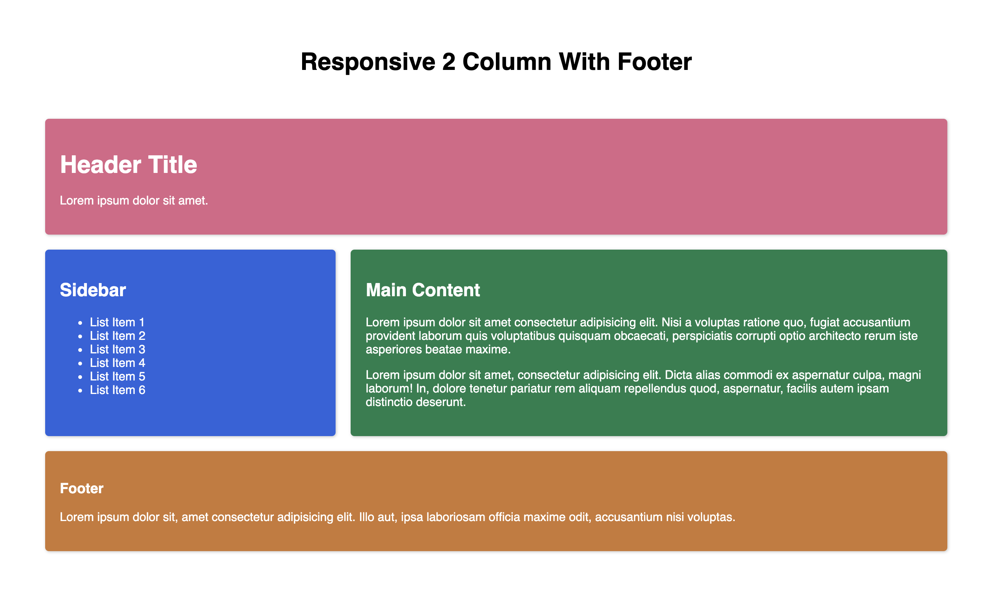

# Getting Started with CSS Grid By Example

This project contains different examples of using CSS Grid. Hopefully, you will find them informative and useful!

## Responsive 3 Column Grid

## Centered Content

## Reordered Content

## Responsive Navbar

## Asymetric Dashboard

## Asymetric Card Layout

## Responsive Card Gallery

## Responsive 2 Column with Footer

## Responsive 2 Column Grid with Footer (Grid Areas)

## Checkerboard Layout

