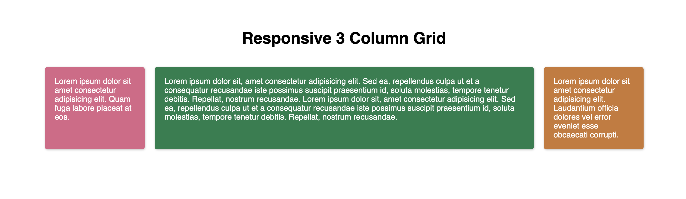

# Getting Started with CSS Grid By Example

This project contains different examples of using CSS Grid. Hopefully, you will find them informative and useful!

For each example, there is a set of starter files and finished files. Open the finished files to see what you need to build. Then, open up the starter files to see if you can complete the example on your own.

## Responsive 3 Column Grid

## Centered Content

## Reordered Content

## Responsive Navbar

## Asymetric Dashboard

## Responsive Card Gallery

## Asymetric Card Layout

## Responsive 2 Column with Footer

## Responsive 2 Column Grid with Footer (Grid Areas)

## Checkerboard Layout

